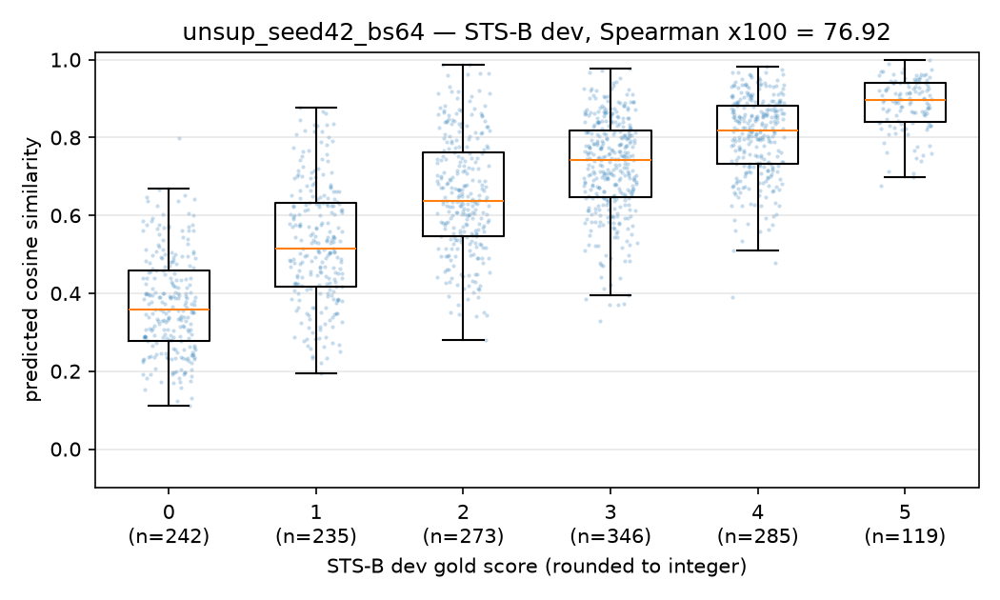
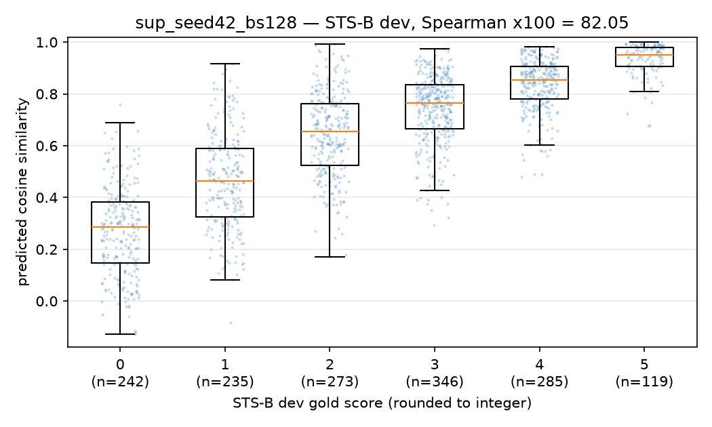
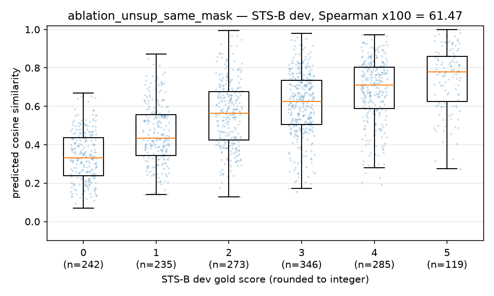
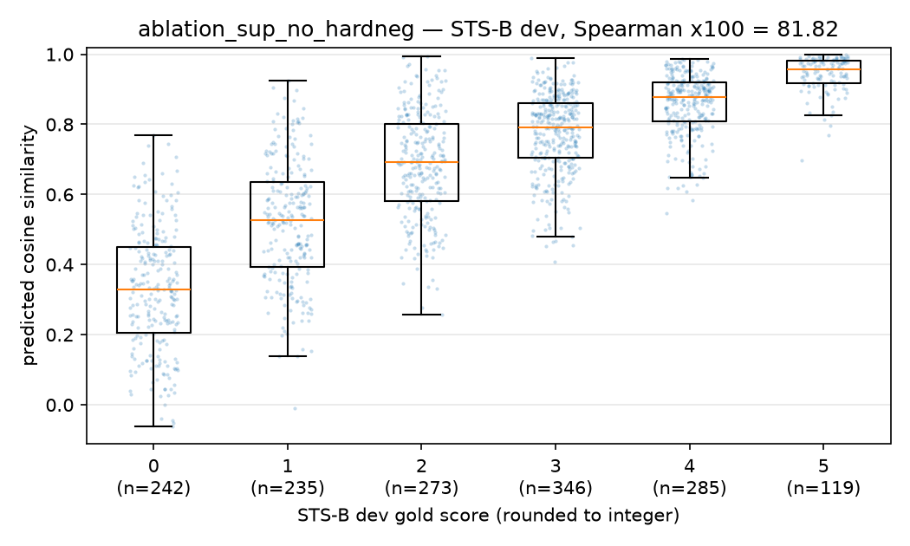

# SimCSE on an SNLI subset — final report (U2T02)

**Team:** Julio Cesar De Aquino Castellanos, Gustavo Alexander Fuentes Marin, Valeria Nicol Hernandez Leon, Ricardo Daniel Horta Sanchez, Jose Angel Pech Xool, Lorena Danae Perez Lopez.

We reproduce unsupervised and supervised SimCSE (Gao, Yao & Chen, EMNLP 2021) with `bert-base-uncased` trained on a 100k-record SNLI subset, evaluate both on STS-B, run one ablation per mode, explain the gap to the paper, and publish both models on the Hugging Face Hub. Sections 3–5 include the per-part reports from `reports/` verbatim (headings shifted one level); the source files remain the reference copies.

## Contents

1. [Part 1 — Objective and conceptual answers](#1-part-1--objective-and-conceptual-answers)
2. [Configuration](#2-configuration)
3. [Benchmark and analysis](#3-benchmark-and-analysis)
4. [Ablations](#4-ablations)
5. [Gap to the paper](#5-gap-to-the-paper)
6. [Optional extensions (Part 8)](#6-optional-extensions-part-8)
7. [Published models](#7-published-models)

## 1. Part 1 — Objective and conceptual answers

> **Pending.** `reports/part1_objective.md` (the Part 1 conceptual write-up) has not been written yet, so it is not included here. This section will be filled in from that file once it exists; nothing has been drafted in its place.

## 2. Configuration

One row per training run, from `configs/*.json` (each run's `runs/<run_id>/config.json` is the same plus `library_versions` and `started`). Every ablation changes exactly one field of its baseline (last flag column). Shared by all four runs: base model `bert-base-uncased`, AdamW, weight decay 0, linear LR decay with no warmup, fp16 AMP, one Tesla T4 on Kaggle (base runs: torch 2.10.0 / Python 3.12; ablations: torch 2.11.0 / Python 3.13; transformers 5.18.0 for all). Gradient clipping: 1.0 for the unsupervised runs, none for the supervised ones. Dev = best periodic STS-B dev Spearman ×100 (the kept checkpoint); test is scored only for the two published models.

| Run | Role | Pooling (train → eval) | LR | Batch | τ | Epochs | Dropout (hidden / attn) | Max len | Seed | Ablated flag | Dev | Test |
|---|---|---|---|---|---|---|---|---|---|---|---|---|
| `unsup_seed42_bs64` | Unsupervised (published) | cls + MLP (train only) → eval `cls_before_pooler` | 3e-05 | 64 | 0.05 | 1 | 0.1 / 0.1 | 32 | 42 | `same_dropout_mask=false` | 76.92 (step 125) | 68.33 |
| `sup_seed42_bs128` | Supervised (published) | cls → eval `cls` | 5e-05 | 128 | 0.05 | 3 | 0.1 / 0.1 | 32 | 42 | `use_hard_negatives=true` | 82.05 (step 350) | 78.75 |
| `ablation_unsup_same_mask` | Ablation of unsup | cls + MLP (train only) → eval `cls_before_pooler` | 3e-05 | 64 | 0.05 | 1 | 0.1 / 0.1 | 32 | 42 | `same_dropout_mask=true` | 61.47 (step 1000) | — |
| `ablation_sup_no_hardneg` | Ablation of sup | cls → eval `cls` | 5e-05 | 128 | 0.05 | 3 | 0.1 / 0.1 | 32 | 42 | `use_hard_negatives=false` | 81.82 (step 150) | — |

Training data (`data/processed/MANIFEST.json`): 165,529 unique SNLI sentences (unsupervised); 33,351 (premise, entailment) pairs, of which 9,488 (28.4%) have a contradiction hard negative (supervised). STS-B: 1,500 dev / 1,379 test pairs.

## 3. Benchmark and analysis

### 3.1 Benchmark table

*Source: `reports/benchmark_table.md` (Part 6).*

Spearman ρ ×100 between cosine similarity and gold scores on STS-B (`sentence-transformers/stsb`; dev = 1,500 pairs, test = 1,379 pairs), protocol of `src/evaluate.py` (no STS-B fine-tuning). Generated by `src/benchmark.py`.

| Model | Dev Spearman | Test Spearman | Alignment ↓ | Uniformity ↓ |
|---|---|---|---|---|
| Our unsupervised SimCSE (`unsup_seed42_bs64`) | 76.92 | 68.33 | 0.305 | -2.963 |
| Our supervised SimCSE (`sup_seed42_bs128`) | 82.05 | 78.75 | 0.220 | -3.362 |
| raw bert-base-uncased (mean pooling) | 59.31 | 47.29 | 0.195 | -1.650 |
| SBERT-2019 (bert-base-nli-mean-tokens) | 80.77 | 76.98 | 0.193 | -3.049 |
| SimCSE paper (unsup, reported) | 82.50 | 76.85 | — | — |
| SimCSE paper (sup, reported) | 86.20 | 84.25 | — | — |

#### Gap to the paper (dev vs. dev, test vs. test)

| Mode | Ours dev | Paper dev | Δ dev | Ours test | Paper test | Δ test |
|---|---|---|---|---|---|---|
| Our unsupervised SimCSE | 76.92 | 82.50 | -5.58 | 68.33 | 76.85 | -8.52 |
| Our supervised SimCSE | 82.05 | 86.20 | -4.15 | 78.75 | 84.25 | -5.50 |

#### Notes

- **Dev** for our models is the best periodic dev evaluation during training, i.e. the score of the checkpoint that was kept (dev was used for checkpoint selection, so it is optimistically biased; test is not).
- **Test** for our models was scored exactly once, by `python src/benchmark.py --score-test`, on that kept checkpoint; raw BERT and SBERT-2019 test numbers come from the Part 4 Phase A run (`runs/run_log.jsonl`), not re-scored here.
- **Pooling:** unsup = `[CLS]` without the training MLP (`cls_before_pooler`); sup = `[CLS]` (trained without an MLP); raw BERT and SBERT-2019 = mean pooling.
- **Alignment / uniformity** (Wang & Isola, 2020; lower is better for both) are computed on STS-B **dev**, L2-normalized embeddings: alignment = mean ‖f(x) − f(x⁺)‖² over the dev pairs with gold ≥ 4/5 (n = 264); uniformity = log mean exp(−2‖f(xᵢ) − f(xⱼ)‖²) over the 2,910 unique dev sentences. Trained models: `reports/eval_<run_id>.json` (Part 4 Phase B); references: `reports/eval_reference_*.json` (this script). The paper rows have no comparable alignment/uniformity number (the paper's Fig. 2 uses a different positive set), hence —. Read the two together: raw BERT's low alignment comes with very poor uniformity (an anisotropic space where *every* pair is close), which is why it scores lowest on STS-B.
- **Paper rows** (Gao, Yao & Chen, EMNLP 2021, BERT-base): unsup dev 82.5 = Table 1, unsup test 76.85 = Table 5; sup dev 86.2 = Table 7, sup test 84.25 = Table 5. Never compare our dev with the paper's test (e.g. 76.92 dev vs. 76.85 test would wrongly suggest the unsupervised gap is zero).

### 3.2 Alignment and uniformity

The alignment / uniformity numbers are the last two columns of the table above (STS-B dev, Wang & Isola 2020; lower is better for both). No separate alignment–uniformity plot was produced in `reports/figures/`; per-run values are in `reports/eval_<run_id>.json`. Both trained models trade some alignment for much better uniformity than raw BERT (−2.96 / −3.36 vs. −1.65); the supervised model improves on both axes relative to the unsupervised one (alignment 0.220 vs. 0.305, uniformity −3.36 vs. −2.96), matching its higher STS-B score.

### 3.3 Similarity distributions

Cosine similarity of STS-B dev pairs against their gold score bucket, per run (Part 4 Phase B).

| | |
|---|---|
|  `unsup_seed42_bs64` |  `sup_seed42_bs128` |
|  `ablation_unsup_same_mask` |  `ablation_sup_no_hardneg` |

### 3.4 Retrievals (Part 4 Phase B)

Nearest neighbours over the 2,910 unique STS-B dev sentences. The full top-5 tables for six sample queries and three human-verified failure cases per run are in `reports/retrievals_<run_id>.md`; the summary and the failure analysis are reproduced here.

#### Unsupervised (`unsup_seed42_bs64`)

#### Paraphrase retrieval over all dev positives

For each of the 264 dev pairs with gold ≥ 4, rank of the gold paraphrase among all other dev sentences:

| Recall@1 | Recall@5 | MRR | wrong top-1 rated unrelated (gold ≤ 1) |
|---|---|---|---|
| 0.830 | 0.958 | 0.885 | 33 |

#### Failure discussion

**F3 ("The man is stirring the rice." → "The man is buttering the bread.", cosine 0.798, gold 0.4/5).** The correct neighbour, "A person is mixing a pot of rice.", is only rank 3 (0.750). The top-2 share the query's exact frame, "The man/cook is <verb>-ing the <food>", and its domain (cooking), but neither the action nor the object matches. Unsupervised SimCSE only learns to be invariant to dropout noise on the *same* sentence. Nothing in Eq. 1 says which tokens carry the meaning of an event, so sentences with the same syntactic template and lexical field stay close, as in pretrained BERT. Both supervised checkpoints retrieve "A person is mixing a pot of rice." as top-1 for this query (0.784 with hard negatives, 0.818 without). NLI entailment pairs explicitly align paraphrases that use different words ("stirring" ≈ "mixing"), which is exactly the signal missing here. The same weakness explains sample query Q4: "cracking eggs into a bowl" retrieves "mixing eggs in the bowl" (0.960), and the gold paraphrase "broke raw eggs" only ranks 6th.

**F1/F2 (earthquake headlines, cosine 0.844, gold 1.0/5).** Two headlines with an identical template ("<magnitude> quake strikes off <place>") describe different events. Annotators score event identity, but the model mostly encodes topic and form. Every checkpoint, supervised ones included, makes this mistake (see the other retrieval files). SNLI captions contain no news headlines and no examples where only a named entity or a number changes the meaning.

#### Supervised (`sup_seed42_bs128`)

#### Paraphrase retrieval over all dev positives

For each of the 264 dev pairs with gold ≥ 4, rank of the gold paraphrase among all other dev sentences:

| Recall@1 | Recall@5 | MRR | wrong top-1 rated unrelated (gold ≤ 1) |
|---|---|---|---|
| 0.890 | 0.985 | 0.929 | 38 |

#### Failure discussion

**F1/F2 (earthquake headlines, cosine 0.844, gold 1.0/5).** "6.4-magnitude quake strikes off Indonesia" and "6.9-magnitude quake strikes off Russia's Kuril Islands" are mutual top-1 neighbours. They share the template and topic, but annotators rated them nearly unrelated because they report different events. Supervision did not help here: the training data is SNLI image captions (no news headlines), and its contradictions are about scene content ("a man is sleeping" vs "a man is running"). None of them teaches that changing the place or the magnitude changes the meaning. The model therefore falls back on topic and form similarity. The remaining neighbours (other earthquake headlines at 0.69–0.83) show that this cluster is organised by topic, not by event.

**F3 ("Military plane crashes in south France" → "…southeastern Turkey, 1 dead", 0.780, gold 1.0/5)** is the same pattern: same event type and template, different instance.

**Contrast with the unsupervised model.** This checkpoint fixes the lexical-paraphrase failures of `unsup_seed42_bs64`. "The man is stirring the rice." now retrieves "A person is mixing a pot of rice." (0.784) instead of "…buttering the bread.", and in Q4 the gold paraphrase "broke raw eggs" moves from rank 6 to rank 1. What remains are "same topic, different specific event" errors. Within STS-B dev these occur mostly in the news domain, outside the SNLI training distribution. "Obama signs law aimed at barring Iran UN envoy" → "Obama urges no new sanctions on Iran" is also still a wrong top-1 here (0.769), but lower than without hard negatives (0.818, see `retrievals_ablation_sup_no_hardneg.md`).

## 4. Ablations

*Source: `reports/ablations.md` (Part 5).*

One ablation per training mode. Each one changes **exactly one field** of the
Part 3 baseline config. Seed (42), batch size, LR, epochs, temperature,
pooling and the rest stay the same, so the delta comes from that one change.
`run_id` also differs, but it is only an identifier. All four runs trained on
Kaggle (Tesla T4, fp16 AMP, 1 GPU used). Every score is Spearman ×100 on the
STS-B **dev** split (1,500 pairs), computed by `src/evaluate.py`. "Best" means
the best of the periodic dev evaluations, which is also the checkpoint kept
under `runs/<run_id>/checkpoint/`.

Test deltas are **not reported yet**. The test split is scored exactly once,
in Part 6, for the final model only. If Part 6 also scores these checkpoints,
add the test column then.

### Results

| Pair | Baseline run | Ablated run | What changed (one field) | Dev baseline | Dev ablated | Δ dev |
|---|---|---|---|---|---|---|
| Unsupervised | `unsup_seed42_bs64` | `ablation_unsup_same_mask` | `same_dropout_mask: false → true` (both views reuse one forward pass and one dropout mask) | 76.92 (step 125) | 61.47 (step 1000) | **−15.4** |
| Supervised | `sup_seed42_bs128` | `ablation_sup_no_hardneg` | `use_hard_negatives: true → false` (Eq. 5 → Eq. 1-style loss on (premise, entailment) pairs, only in-batch negatives) | 82.05 (step 350) | 81.82 (step 150) | **−0.23** |

Reference: raw `bert-base-uncased` with mean pooling scores 59.31 dev.

Training curves (from each run's `results.json`):

| Run | Dev range over all evals | Same-step Δ vs baseline (mean ± sd, n) | Training loss, last 250 steps |
|---|---|---|---|
| `unsup_seed42_bs64` | 74.29 – 76.92 | — | ~1.3e-4 |
| `ablation_unsup_same_mask` | 61.17 – 61.47 | −13.8 ± 0.6 (n = 21, every step between −12.9 and −15.6) | ~7.6e-7 |
| `sup_seed42_bs128` | 81.30 – 82.05 | — | ~0.46 |
| `ablation_sup_no_hardneg` | 81.06 – 81.82 | −0.36 ± 0.17 (n = 16, ablation lower at 16/16 steps) | ~0.40 |

### Noise estimate

Each config has only one seed (42). No baseline was rerun with another seed,
so the noise level below is a reasoned estimate, not a measurement. It
combines three sources:

1. **Sampling noise in the dev set.** On n = 1,500 pairs at ρ ≈ 0.82, the
   Fisher-z standard error of a correlation is
   (1 − ρ²)/√(n − 3) ≈ 0.0085, or **about 0.85–0.9 points** for Spearman.
   Both models are scored on the same pairs, so the paired SE of the
   difference is smaller. It is still likely a few tenths of a point. A paired
   bootstrap on the two checkpoints would measure it.
2. **Variation between checkpoints in one run.** The supervised baseline's dev
   score moves within a 0.75-point band (81.30–82.05) across its 16 evals. The
   ablation moves within 0.76 points. "Best dev" is the maximum of 16 noisy
   readings, so it is biased upward by an amount close to that band's spread.
3. **Variation between seeds.** We did not measure it. For BERT-base
   contrastive fine-tuning on STS-B it is usually a few tenths of a point in
   supervised mode and around 1 point in unsupervised mode, where SimCSE is
   known to be more sensitive to seed.

Taking these together, a reasonable noise floor for comparing two runs that
each have one seed is **about ±0.5 points (supervised) and about ±1 point
(unsupervised)**.

- **Unsupervised, −15.4.** This is more than 15× the noise floor. The two dev
  curves never overlap: the ablation's best (61.47) is 12.8 points below the
  baseline's worst (74.29). The effect is real.
- **Supervised, −0.23.** This is **below** the single-seed noise floor. It is
  smaller than the sampling SE, smaller than either run's own variation
  between checkpoints, and smaller than typical seed variance. On its own it
  is **not a significant difference**. One observation points in the
  expected direction: the ablation is lower at all 16 matched eval steps
  (mean −0.36). Both runs share a seed and data order, so this comparison is
  partly paired. That consistency suggests a small real effect. It does not
  prove one, because the two runs' dropout RNG streams diverge after step 1:
  the ablated forward pass has fewer rows. Confirming it would take at least
  2 more seeds per config, comparing means.

### Mechanisms

#### Unsupervised: a shared dropout mask removes the alignment signal (real collapse)

Unsupervised SimCSE (Eq. 1) has only one source of augmentation: two dropout
masks. In the baseline, each sentence appears twice in one forward pass, so
rows *i* and *B+i* get independent masks and become two slightly different
views. With `same_dropout_mask=true`, `src/train_simcse.py` runs one forward
pass and uses `z1 = z2 = z`, so the two views are literally the same tensor.
This has three consequences:

- After L2 normalisation the positive cosine is exactly 1. The positive logit
  is the constant 1/τ = 20, and its gradient is zero. The **alignment** term
  of the objective (Wang & Isola) is gone.
- The only way left to lower the loss is to push the 63 in-batch negatives
  apart. The objective becomes **uniformity only**. The model can reach almost
  zero loss without learning anything about which sentences mean similar
  things.
- On the STS-B dev split, that matches what we see. The run gains a little
  early, from spreading out BERT's anisotropic [CLS] space; it lands slightly
  above raw-BERT mean pooling (59.31). Then it stops improving: dev stays at
  61.2–61.5 for the whole epoch. The baseline, which does get an alignment
  gradient, reaches 76.92.

The paper's own ablation shows the same thing. In SimCSE §3, Table 3
("Effects of different dropout probabilities"), "Fixed 0.1" means the same
dropout mask for both views, and it causes a large drop on STS-B dev: 43.6,
down from 82.5 for the paper's default (different dropout masks). The
authors attribute it to representation collapse, because the positive pair
no longer carries any information. Our drop (76.92 → 61.47) is smaller in
absolute terms — likely because our setup (CLS pooling, `mlp_only_train`,
smaller/easier SNLI-derived training set) doesn't collapse as completely in
one epoch — but the direction and the mechanism are the same.

#### The same log symptom had two different causes

Both unsupervised runs triggered the same automatic alert in
`run_record.json`: *"final training loss < 1e-3: possible collapse (identical
views?)"*. For the baseline it was a **false positive**. For this ablation it
is a **real collapse**. The symptom (near-zero InfoNCE loss) is the same, but
the cause differs:

| | `unsup_seed42_bs64` (baseline) | `ablation_unsup_same_mask` |
|---|---|---|
| Views | independent dropout masks | the same tensor (`z1 = z2`) |
| Positive cosine | ~0.83 on average (min 0.78), measured locally | exactly 1.0 by construction |
| Why the loss is small | τ = 0.05 turns the gap between positive and negatives (0.83 vs ~0.28) into a logit gap of ~11, so loss ≈ 63·e⁻¹¹ ≈ 1e-3. The task is easy, but the positive term still has a gradient. | The positive logit is a constant 20. The loss falls only through negative repulsion, a task that is trivially solvable. |
| Loss plateau | ~1e-4 | ~7.6e-7 (~170× lower), reached by step 50 |
| Dev Spearman | 76.92, well above raw BERT | 61.47, flat for all 21 evals |
| Verdict | not collapsed | collapsed alignment |

**Lesson:** a near-zero contrastive loss does not, on its own, diagnose
collapse. With a small τ, a model that has learned the task correctly can
also drive the loss toward zero. Two checks tell the cases apart. First,
check whether the positive pair is trivially identical (positive cosine equal
to 1, a single forward pass reused). Second, check whether dev Spearman moves
during training. The alert threshold is a useful prompt to look closer, but
it cannot decide the question.

#### Supervised: hard negatives sharpen fine-grained separation, but the effect is small here

With `use_hard_negatives=true` (Eq. 5), each premise's softmax denominator
also contains the contradiction hypotheses of the batch. SNLI contradictions
usually overlap heavily with the premise in words and topic ("A man is
playing a guitar" / "A man is not playing an instrument"), so they are
negatives that sit close to the anchor. Pushing them away forces the encoder
to encode meaning differences that go beyond topic and lexical overlap. That
is what STS-B rewards in its middle range of similarity scores. Without hard
negatives (Eq. 1 on the supervised pairs), the 127 in-batch negatives are
mostly unrelated sentences. They are easy to separate, so the task gets
easier. Its final loss is ~0.40, against ~0.46 for the baseline, and it
pushes less on the semantic boundary.

The measured effect (−0.23 best, −0.36 at matched steps) has the expected
sign but is far smaller than in the paper. SimCSE Table 7 ("STS-B
development results with different hard negative policies") reports +1.3
points on STS-B dev from adding contradiction hard negatives (no hard
negative: 84.9 → with weighted contradiction: 86.2; contradiction alone
already reaches 86.1, so most of the gain comes from adding the hard
negative at all, not from the weighting). Likely reasons:

- **Hard-negative coverage, the main cause (see `reports/gap_analysis.md` for
  the full derivation).** The paper's 314k SNLI+MNLI triplets (Table 4) give
  a hard negative for every anchor. Our 100k-row SNLI subset gives 33,351
  triplets, but only 9,488 of them (28.4%) have a contradiction hypothesis
  for the same premise — most anchors train with no hard negative at all. If
  the paper's +1.3-point gain (Table 7, 84.9 → 86.2) scales linearly with
  coverage, we'd expect 1.3 × 0.284 ≈ 0.37 — almost exactly the +0.36 we
  measured at matched steps. Coverage alone explains nearly all of the
  shortfall versus the paper's effect size.
- **Early best checkpoints.** Both runs peak early (steps 150 and 350 of
  780), so most of the training where hard negatives would matter does not
  affect the selected checkpoint.
- **A large batch.** With batch size 128, the in-batch entailment negatives
  already supply much of the uniformity signal.

With one seed per config, we can only say that hard negatives help by at most
a few tenths of a point in this setup. We cannot claim a significant gain.

## 5. Gap to the paper

*Source: `reports/gap_analysis.md` (Part 6).*

All numbers are STS-B Spearman ×100, BERT-base. We compare dev with dev and
test with test (see `reports/benchmark_table.md`). Paper numbers: Gao, Yao &
Chen (EMNLP 2021). Unsup dev is from Table 1 and unsup test from Table 5. Sup
dev is from Table 7 and sup test from Table 5. Paper setup details below come
from §3, §4, Table 4, Table 6 and Appendix A (Table A.1), checked against the
arXiv PDF.

### The gap

| Mode | Ours dev | Paper dev | **Δ dev** | Ours test | Paper test | **Δ test** | Our dev→test drop | Paper dev→test drop |
|---|---|---|---|---|---|---|---|---|
| Unsupervised (`unsup_seed42_bs64`) | 76.92 | 82.5 | **−5.58** | 68.33 | 76.85 | **−8.52** | 8.59 | 5.65 |
| Supervised (`sup_seed42_bs128`) | 82.05 | 86.2 | **−4.15** | 78.75 | 84.25 | **−5.50** | 3.30 | 1.95 |

For comparison, the dev→test drop is 12.02 for raw `bert-base-uncased` (59.31
→ 47.29) and 3.79 for SBERT-2019 (80.77 → 76.98). STS-B test is harder than
dev for every model. It is hardest for models that stay close to raw BERT.

The test gap is larger than the dev gap in both modes: by 2.94 points for
unsupervised and 1.35 for supervised. Comparing our dev 76.92 with the paper's
test 76.85 would hide all of this, which is why the two splits are kept
apart.

### Setup differences

| | Paper (BERT-base) | Ours | Source |
|---|---|---|---|
| Unsup training data | 10⁶ sentences sampled from **English Wikipedia** | **165,529** unique SNLI sentences (premises and hypotheses of a 100k-record subset) | §3 fn. 2, §4; `data/processed/MANIFEST.json` |
| Sup training data | SNLI + MNLI, **314k** (premise, entailment, contradiction) triplets | **33,351** SNLI (premise, entailment) pairs from the 100k-record subset (no-consensus records dropped, then sampled). Only **9,488 (28.4%)** have a contradiction | §4, Table 4; MANIFEST |
| Hard negatives | One per triplet (every anchor) | One for 28.4% of anchors (first contradiction for the same premise); 71.6% have none | §4 fn. 7; MANIFEST `hard_negative_rule` |
| Unsup bs / LR / epochs | 64 / 3e-5 / 1 | 64 / 3e-5 / 1 (same) | Table A.1; `configs/unsupervised.json` |
| Sup bs / LR / epochs | **512** / 5e-5 / 3 | **128** / 5e-5 / 3 (LR not re-tuned for the smaller batch) | Table A.1; `configs/supervised.json` |
| Optimizer steps (unsup) | 10⁶ / 64 ≈ 15,600 | 2,586 (best checkpoint at **step 125** = 8,000 sentences seen) | `runs/unsup_seed42_bs64/results.json` |
| Optimizer steps (sup) | 314k / 512 × 3 ≈ 1,840 (942k anchor-views) | 780 (100k anchor-views); best at step 350 | `runs/sup_seed42_bs128/results.json` |
| τ, max length, dropout | 0.05, 32, 0.1 | same | configs |
| Pooling | [CLS] + MLP. Unsup drops the MLP at test time; the paper's final sup model keeps it | Unsup: same. Sup: no MLP at all (`mlp_only_train: false` builds none) | Table 6; `src/train_simcse.py` |
| Grad clipping | HF default (1.0) | unsup 1.0; **sup none** (`max_grad_norm: null`) | configs |
| Dev eval frequency / selection | every 250 steps, keep best | every 125 (unsup) / 50 (sup) steps, keep best | App. A; configs |
| Hyperparameter search | grid of batch ∈ {64,128,256,512} × LR ∈ {1e-5,3e-5,5e-5} = **12 configs per model**, plus ablations of τ, p, pooling and hard-negative α on dev | **1 config per mode, no search.** The unsup config copies Table A.1. The sup config uses the paper's LR with a 4× smaller batch. The two Part 5 runs are ablations (one method flag each), not a search | App. A; `runs/run_log.jsonl` |
| Seeds | best-checkpoint numbers for one setting | 1 seed (42) per config | run log |
| Hardware / precision | — | 1× Kaggle Tesla T4, fp16 AMP; 618 s (unsup), 434 s (sup) | run log `hardware` |
| Things that broke | — | Unsup: "loss < 1e-3, possible collapse" alert. Investigated and found to be a **false positive** (positive cosine ≈ 0.83, not 1; the low loss comes from τ = 0.05). Sup: nothing (`notes` empty) | run log `notes` |

### Attribution of the gap

These are estimates. Every config has one seed, and we did not re-run with
the paper's data. Where the paper has a controlled comparison, we extrapolate
from it; otherwise the share is reasoned from our training curves. The
single-seed noise floor estimated in `reports/ablations.md` is about ±0.5
(sup) and ±1 (unsup). A residual smaller than that cannot be told apart from
zero.

#### Supervised: −4.15 dev / −5.50 test

| Factor | Dev (pts) | Test (pts) | How the number was obtained |
|---|---|---|---|
| **Training data size and source** (33k SNLI pairs vs. 314k SNLI+MNLI) | **~2.1** (1.5–3) | **~3.1** | Paper Table 4, entailment-only positives: 134k → 314k pairs (2.3×) gives 84.1 → 84.9, i.e. +0.8, or ~0.65 per doubling. We have 9.4× fewer pairs (3.2 doublings), so ~2.1 dev. On test we add ~1.0 of the extra dev→test drop (3.30 vs. 1.95): a single-genre SNLI caption corpus transfers worse to the test genres than SNLI+MNLI does. |
| **Hard-negative coverage** (28.4% of anchors vs. 100%) | **~1.0** | **~1.0** | The paper gains +1.3 from hard negatives (Table 7, 84.9 → 86.2). We measured +0.23 (best) / +0.36 (matched steps). The missing ~1.0 is the gain we did not get. The next section explains why. |
| **No hyperparameter search; sup batch 128 with an LR tuned for 512** | **~0.3** (0–0.5) | **~0.3** | The paper reports that SimCSE is "not sensitive to batch sizes as long as tuning the learning rates accordingly". We did not tune the LR, so we assume a small loss. We tried 1 config against the paper's 12. |
| **Dev-selection optimism** (best of 16 dev evals) | (inflates our dev; shrinks the dev gap) | **~0.4** | Our sup dev curve spans 81.30–82.05. The selected 82.05 sits at the top of that band, so part of it does not carry over to test. |
| Pooling without MLP, no grad clipping, fp16, eval frequency | **~0** | **~0** | Table 6: sup [CLS] w/o MLP = 86.2 = w/ MLP. Clipping, fp16 and a denser eval schedule have no documented effect of this size. |
| **Unexplained / seed noise** | **~0.75** | **~0.7** | Residual; comparable to the ±0.5 single-seed floor. |
| **Total** | **4.15** | **5.50** | |

Roughly: on dev, data ≈ 50%, hard negatives ≈ 25%, hyperparameters ≈ 7%,
unexplained ≈ 18%. On test, data ≈ 56%, hard negatives ≈ 18%, hyperparameters
≈ 5%, selection ≈ 7%, unexplained ≈ 13%.

Data size and hard-negative coverage are not independent. Both come from
using one 100k-record SNLI subset, so the whole ~3.1 dev points (~4.1 test)
traces back to Part 2's data preparation, not to the training code.

#### Unsupervised: −5.58 dev / −8.52 test

| Factor | Dev (pts) | Test (pts) | How the number was obtained |
|---|---|---|---|
| **Training data source and size** (165k short SNLI sentences vs. 10⁶ Wikipedia sentences) | **~4.5** (3.5–5) | **~6.5** | Our hyperparameters match Table A.1, so most of the gap has to come from the data. Our curve shows that data is the binding constraint: dev peaks at the **first** eval (step 125, after only 8,000 sentences). It then drifts **down** to 74.6 over the remaining 2,461 steps. More SNLI training hurts rather than helps, so the problem is not too few steps but the narrow caption-style domain. On test, the checkpoint (8k sentences into training) is still close to raw BERT, whose dev→test drop is 12.0. This accounts for ~2 of the 2.94 extra dev→test drop. |
| **Compute / steps** (2,586 vs. ~15,600) | **~0** directly | **~0** | Not binding. The best checkpoint is at step 125 and later steps lower dev. More steps on the same data would not close the gap; more steps on Wikipedia-scale data would, but that effect is counted under data. |
| **No hyperparameter search** | **~0.5** (0–1) | **~0.5** | We copied the paper's grid winner (bs 64, LR 3e-5) instead of re-tuning it for a different, much smaller corpus. The early peak suggests a lower LR or a shorter schedule might have helped, but we tried 1 config against the paper's 12. |
| **Dev-selection optimism** (best of 21 evals; the best is 1.06 above the next) | (inflates our dev; shrinks the dev gap) | **~1.0** | The selected step-125 score (76.92) is an isolated maximum; every later eval falls in 74.3–75.9. A single high reading on 1,500 dev pairs does not carry fully to test. |
| eval every 125 vs. 250 steps, fp16, pooling | **~0** | **~0** | Same pooling as the paper (MLP in training only, Table 6: 82.5). The denser eval schedule is, if anything, an advantage. |
| **Unexplained / seed noise** | **~0.6** | **~0.5** | Within the ±1 single-seed floor for unsup SimCSE. |
| **Total** | **5.58** | **8.52** | |

Roughly: on dev, data ≈ 80%, hyperparameters ≈ 9%, unexplained ≈ 11%. On
test, data ≈ 76%, selection ≈ 12%, hyperparameters ≈ 6%, unexplained ≈ 6%.

The unsupervised data shift is a change of **source**, not only of size. The
paper never trains unsup SimCSE on NLI sentences. Note that the Part 6 handoff
calls the paper's unsup corpus "NLI-derived", which is wrong (§3 fn. 2:
"We randomly sample 10⁶ sentences from English Wikipedia"). Because the
paper has no Wikipedia-subsample ablation, the ~4.5 is the residual left
after the other factors, not a direct extrapolation. Its range is wider than
the supervised data estimate.

### Part 5 finding: why our hard-negative effect is ~5× smaller than the paper's

The paper gets +1.3 dev from contradiction hard negatives (Table 7: 84.9 with
none, 86.2 with α = 1; Table 4 shows the same 84.9 → 86.2). Our Part 5
ablation (`ablation_sup_no_hardneg` vs. `sup_seed42_bs128`) gets +0.23 at the
best checkpoint and +0.36 averaged over 16 matched eval steps. That is
**3.6–5.7× smaller**, about 5×.

The main cause is **coverage**, which `reports/ablations.md` does not list.
In the paper, every anchor has a contradiction hypothesis (§4: "for each
premise and its entailment hypothesis, there is an accompanying contradiction
hypothesis"). In our data only 9,488 of 33,351 anchors (28.4%) have one,
because the 100k-record subset breaks up most premise triplets.
`src/train_simcse.py` adds only the non-null contradictions to the
denominator. A batch of 128 therefore has ~36 hard negatives, against 512 in
a paper batch of 512, and 72% of anchors never see a hard negative of their
own. In absolute terms we train on ~33× fewer hard negatives (9.5k vs. 314k).

If the paper's gain scaled linearly with coverage, we would expect
1.3 × 0.284 ≈ **0.37**. We measured **0.36** (matched-step mean). Coverage
alone accounts for nearly the whole 5× shortfall. The other reasons in
`ablations.md` (less data overall, early best checkpoints, the large in-batch
negative pool) may add to it, but they are not needed to explain the
magnitude. Small fixes for `ablations.md`: the paper's supervised set is
314k triplets, not ~275k, and the coverage effect should be listed first.

A direct fix would be to rebuild `sup_pairs.jsonl` from the full SNLI (or
SNLI+MNLI) so that every anchor has a contradiction, then re-run the ablation
pair with ≥ 3 seeds. We expect that to recover most of the ~1.0-point
hard-negative share of the supervised gap.

### Bottom line

- **Supervised (−4.15 dev / −5.50 test):** about three quarters of the gap is
  explained by the data subset: 9.4× fewer pairs (~2.1 / ~3.1) and 28%
  hard-negative coverage (~1.0). The rest is untuned hyperparameters (~0.3),
  dev-selection optimism on test (~0.4) and noise (~0.7).
- **Unsupervised (−5.58 dev / −8.52 test):** about four fifths of the gap is
  the training corpus (SNLI captions instead of 10⁶ Wikipedia sentences).
  Dev peaking after 8k sentences and then declining shows that more
  training on this corpus would not help. On test, an early, dev-optimistic
  checkpoint adds ~1.0 more.
- Neither gap points to a bug in the objective or the evaluation. The eval
  harness reproduces raw BERT and SBERT-2019 to ±0.00 (Part 4 Phase A). Our
  unsup model is 17.6 dev points above raw BERT. Our sup model beats
  SBERT-2019 by 1.3 dev and 1.8 test while training on 33k SNLI pairs
  against SBERT's ~1M SNLI+MNLI pairs (~1/30).

## 6. Optional extensions (Part 8)

Not done. No Part 8 extension has been carried out.

## 7. Published models

Both models are public on the Hugging Face Hub as `sentence-transformers` models (`Transformer` → `Pooling(cls)` → `Normalize`, cosine similarity), exported by `src/publish.py`. Each was verified by reloading it from the Hub into an empty cache and re-running `evaluate_sts` on `data/stsb/test.jsonl`: the reloaded test Spearman equals the recorded one to floating-point precision. The Hub repo id is recorded as `hub_repo_id` on each run's line in `runs/run_log.jsonl`.

| Hub repo | Run | STS-B test (×100) | Model card |
|---|---|---|---|
| [`pyrawn/simcse-bert-base-snli-unsup`](https://huggingface.co/pyrawn/simcse-bert-base-snli-unsup) | `unsup_seed42_bs64` | 68.33 | [`model_cards/simcse-bert-base-snli-unsup/README.md`](../model_cards/simcse-bert-base-snli-unsup/README.md) |
| [`pyrawn/simcse-bert-base-snli-sup`](https://huggingface.co/pyrawn/simcse-bert-base-snli-sup) | `sup_seed42_bs128` | 78.75 | [`model_cards/simcse-bert-base-snli-sup/README.md`](../model_cards/simcse-bert-base-snli-sup/README.md) |
